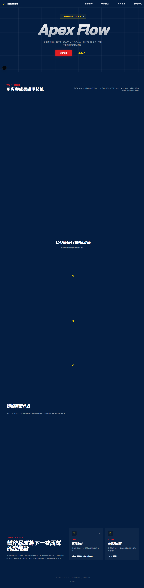

# Apex Flow | 前端工程師作品集

## 專案概述

Apex Flow 是一個前端工程師個人作品集網站，用來展示精選專案、技術能力與實作經驗，並以單頁式架構提供清楚且完整的瀏覽體驗。

本專案採用 Next.js App Router，重點放在：

- 專案敘事清楚
- 版面具備響應式設計
- 程式結構可維護

## 預覽



## 線上展示

本專案預計部署於 Netlify，倉庫內已包含 Netlify 相關設定。

正式網址：

- https://apex-flow-portfolio.netlify.app/

## 技術棧

- Next.js
- React
- TypeScript
- Tailwind CSS
- Framer Motion
- Lucide React
- ESLint
- Netlify
- npm

## 主要功能

- Hero 區塊：呈現 Apex Flow 作品集識別。
- Dashboard 風格區塊：展示前端技能定位與強項。
- Career / Project 敘事區塊：整理經歷與專案脈絡。
- Project Gallery：展示精選作品。
- Project Detail Modal：提供專案的延伸資訊。
- Contact 區塊：提供 GitHub 等聯絡入口。
- 響應式版面：支援常見桌面與行動裝置寬度。

## 專案結構

```text
red-bull-portfolio/
+-- public/
|   +-- brand/
|   +-- projects/
+-- src/
|   +-- app/
|   +-- components/
|   +-- data/
|   +-- types/
+-- AGENTS.md
+-- DESIGN.md
+-- netlify.toml
+-- package.json
+-- README.md
```

## 快速開始

先複製專案並安裝依賴：

```bash
git clone https://github.com/Harry-0824/red-bull-portfolio.git
cd red-bull-portfolio
npm install
```

啟動本機開發伺服器：

```bash
npm run dev
```

開啟瀏覽器進入 [http://localhost:3000](http://localhost:3000)。

## 可用指令

```bash
npm run dev
```

啟動 Next.js 本機開發伺服器。

```bash
npm run build
```

建立正式環境建置輸出。

```bash
npm run lint
```

執行 ESLint 程式碼檢查。

```bash
npm run start
```

在建置完成後啟動正式模式伺服器。

## 備註

- 本專案使用 npm 作為套件管理與指令執行工具。
